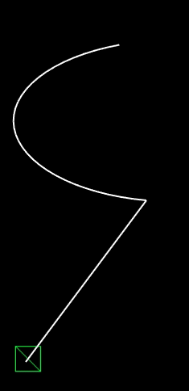

# Path following recipes in Phaser 3

Sometimes you want your game objects to follow a predefined path, and Phaser makes this very easy. In this tutorial we take advantage of the `get`/`set` syntax in javascript to build a generic function that can be passed as the target of a [Tween](https://photonstorm.github.io/phaser3-docs/Phaser.Tweens.Tween.html) to control the position over a [Path](https://photonstorm.github.io/phaser3-docs/Phaser.Curves.Path.html). 


Let's start by making an example path to follow (you can find the full Path API [here](https://photonstorm.github.io/phaser3-docs/Phaser.Curves.Path.html)):

```javascript
const path = new Phaser.Curves.Path(50, 500);
path.lineTo(700, 300);
path.ellipseTo(200, 100, 100, 250, false, 0);
```

You can see what this path looks like in the animations below.

## A generic path follower to attach to tweens

Tweens attach to a property of an object, in this case `t`. It reads the initial value and then will set it every time the tween updates. Here is a follower that takes advantage of this:

```javascript
function makeTweenFollower(path, tickCallback) {
    return {
        vec: new Phaser.Math.Vector2(),
        get t() { return 0 }, // initial value, only read once by the tween at the start
        set t(val) {
            path.getPoint(val, this.vec); 
            tickCallback(this.vec.x, this.vec.y);
        }
    };
}
```

Here the function you pass to tickCallback will be executed at every tick of the tween, with x and y as parameters which are a position on the path: the starting point at the first tick and the end at the last tick.

**Here is a usage example:**

```javascript
// in the context of a scene. So this is an instance of Scene.
var s = this.add.sprite(0, 0, 'player');
this.tweens.add({
    targets: makeTweenFollower(path, (x, y) => {
        s.x = x;
        s.y = y;
    }),
    t: 1,
    duration: 4000 // you can also add easing, yoyo etc.
});
```
[**Full source**](resources/20190131-tween-follower/follow-path-tween.js)

**And the result:**




## Bonus: using game time instead of a tween


Sometimes you will want to use the scene's `update` method that provides the game time as first parameter:

```javascript
let pos = new Phaser.Math.Vector2();

function update (t, dt) {
    path.getPoint(Math.sin(t / 500) / 2 + .5, pos);
    s.x = pos.x; s.y = pos.y;
}
```
[**Full source**](resources/20190131-tween-follower/game-time.js)


